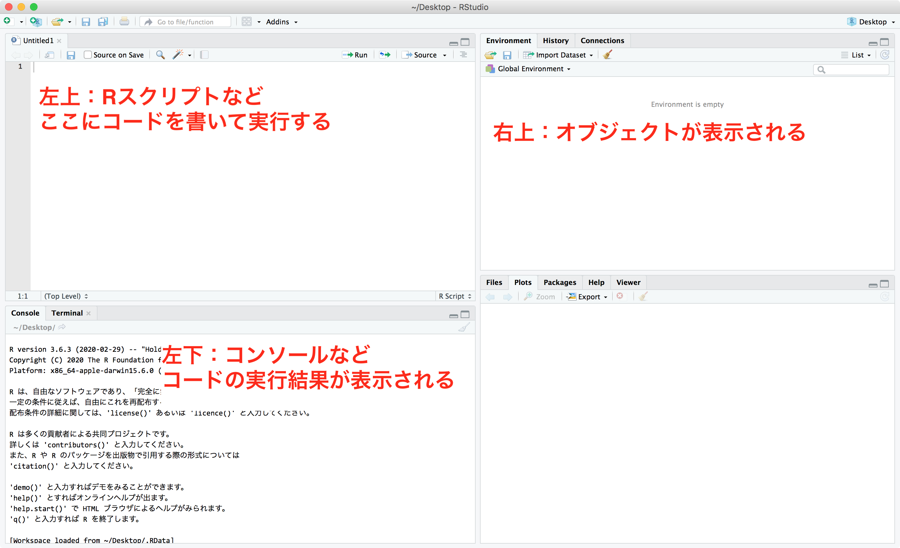
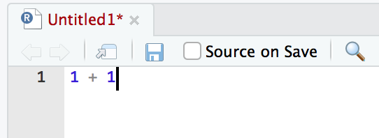
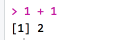
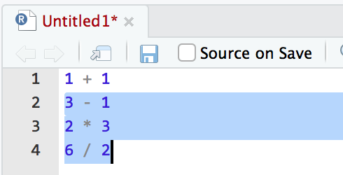
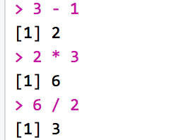
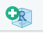
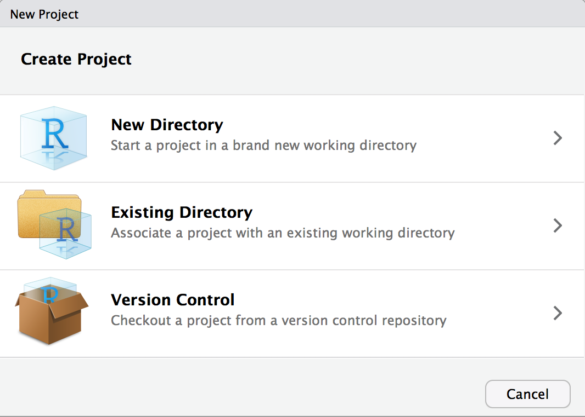
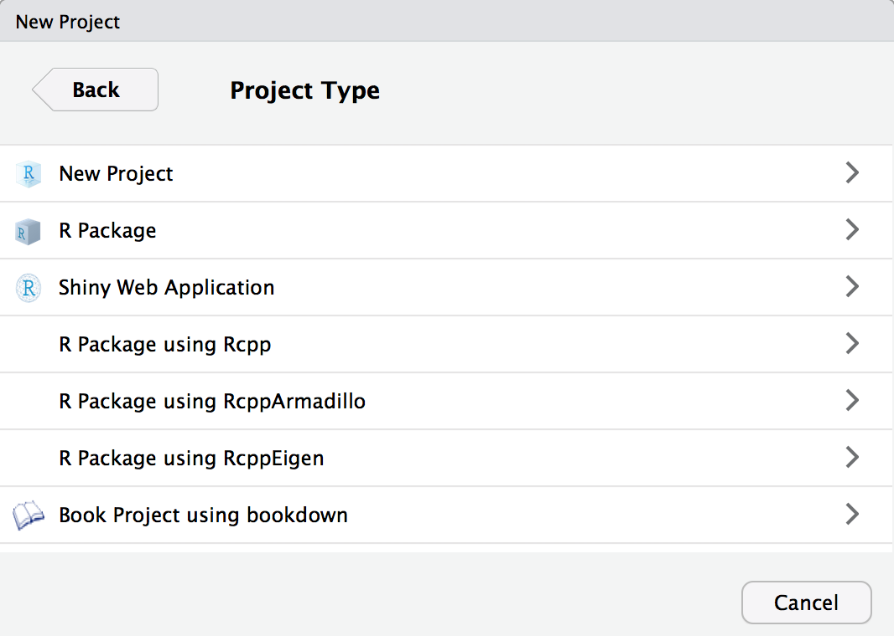
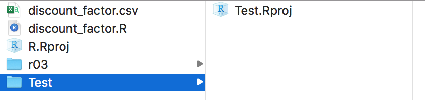

```{r library RStudio, echo = FALSE}
library(knitr)
```


# RStudioの使い方 {#RStudio}

## RStudioの起動

それでは、RStudioを起動してみましょう。
正しくインストールされていれば、Windowsはスタートメニュー、Macの場合はアプリケーションのアイコンをクリックして起動できるはずです。
R本体はインストールされていればOKです。自分で起動する必要はありません。

RStudioは今後何度も起動するので、ショートカットを作ってデスクトップから起動できるようにしておくと便利です。

## RStudioの画面

人によって多少異なりますが、RStudioを起動した画面は以下のようになっています。

```{r RStudio_screen, echo = FALSE, out.width = "70%"}

```

RStudioは通常4つのウィンドウ（ペーンと呼びます）に分割されます。
ここでは各ペーンの概要を説明します。

- 左上のペーンはRStudioを動かすためのコードを書く場所です。表示されていなければ、左上の緑の＋をクリックし、「R Script」を選択してください。
- 左下のペーンはコンソールと呼ばれる、コードの実行結果を表示する場所です。ここに直接コードを書くこともできますが、コードは保存されません。
- 右上のペーンは後述する「オブジェクト」が表示される場所です。
- 右下のペーンはファイルやパッケージなどが表示される場所です。

## RStudioの操作

それでは、実際に操作してみましょう。Rスクリプトに`1 + 1`と打ってみてください。

```{r image basic1, echo = FALSE, out.width = "40%"}

```

これが1行のコードになります。この行にカーソルを合わせた状態で、WindowsではCtrl + Enter、MacではCommand + Enterを押してください。
（スクリプト右上のRunを押しても良いです）

```{r image basic2, echo = FALSE, out.width = "20%"}

```

すると、コンソールに結果が表示されました。> 1 + 1は実行したコードを表しています。
[1]は行番号を表します。その右側が結果です。

もう少しコードを書いてみましょう。`3 - 1` `2 * 3` `6 / 2`と3行のコードを書いてください。

```{r image basic3, echo = FALSE, out.width = "40%"}

```


これをまとめて選択してCtrl + Enter (Command + Enter)を押してください。

```{r image basic4, echo = FALSE, out.width = "20%"}

```


すると、それぞれの計算結果が表示されました。

スクリプトにコードを書く→実行してコンソールで結果を確認、という一連の作業を繰り返して慣れていきましょう。

## スクリプトの保存

スクリプトはWindowsはCtrl + S、MacはCommand + Sで保存することができます。
スクリプトを保存しておけば、次回に書き直す必要はありません。
卒業論文では、何度もスクリプトを書き直すので、きちんと保存しておきましょう。

## プロジェクトの作成

RStudioには「プロジェクト」という機能があり、これを使うとファイル管理がしやすくなります。
プロジェクトはコンピュータ内にフォルダを作成し（または既存のフォルダを指定し）、そのフォルダの中で作業を行います。

プロジェクトを作成してみましょう。
左上の左から２つ目の緑の＋を押してください。

```{r image project1, echo = FALSE, out.width = "5%"}

```

表示されるウィンドウで、"New Directory"を選んでください。

```{r image project2, echo = FALSE, out.width = "50%"}

```

次のウィンドウでは、"New Project"を選んでください。

```{r image project3, echo = FALSE, out.width = "50%"}

```

次の画面で作成するフォルダ名（プロジェクト名になります）とフォルダの作成場所を指定します。
**フォルダ名は英数字のみとしてください。フォルダを作成する場所も英数字となるような場所にしてください。**

指定したら、Create Projectを押してプロジェクトを作成してください。

```{r image project4, echo = FALSE, out.width = "50%"}
include_graphics("image/project4.png")
```

コンピュータで指定したフォルダに行き、フォルダが新たに作成されていること、[プロジェクト名.Rproj]というファイルが中に作成されていることを確認してください。

```{r image project5, echo = FALSE, out.width = "50%"}

```

Testというフォルダが新たに作られ、中にTest.Rprojというファイルが入っています。

RStudioを使う際は、プロジェクトをベースに作業するようにしましょう。

- 起動の際は、プロジェクト名.Rprojをクリックして起動する。
- 使用するファイルは、プロジェクトのフォルダに移動・保存するようにする。
- RStudioでファイルを作成した場合、このフォルダに保存されます。

試しに、新しいRスクリプトを作成（左上の緑の＋を押す）し、保存して見てください。
フォルダ内にRスクリプト（.Rで終わるファイル）ができていれば成功です。
